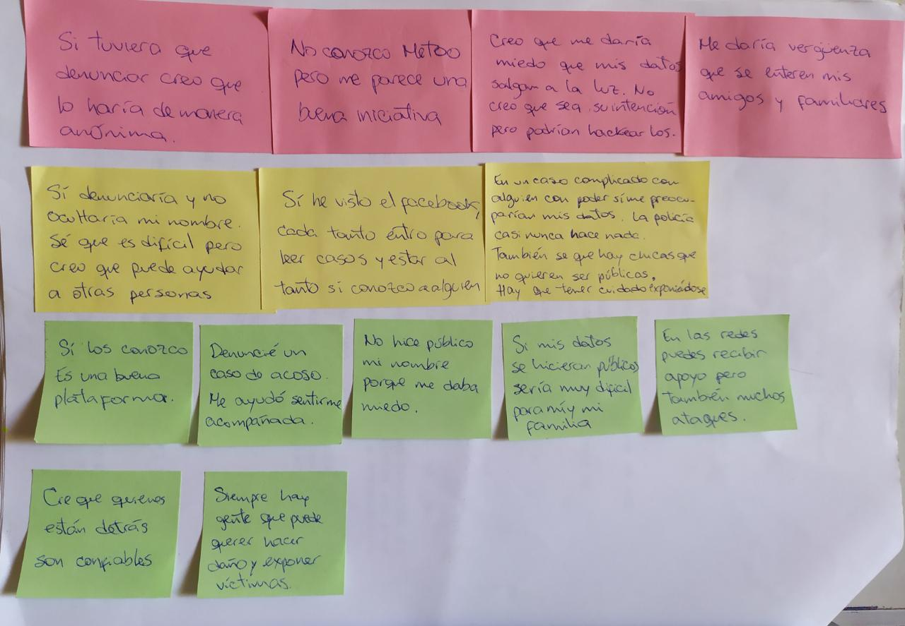
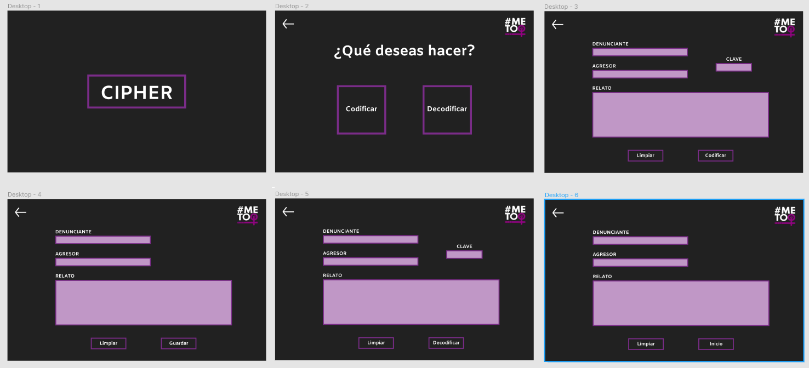

# CIPHER

## Índice

* [1. Resumen del proyecto](#1-resumen-del-proyecto)
* [2. Investigación UX](#2-investigación-ux)
* [3. Next steps](#3-next-steps)
* [4. Objetivos de aprendizaje cipher](#4-objetivos-de-aprendizaje-cipher)

***

## 1. Resumen del proyecto
**CIPHER** es una app que busca crear mayor seguridad en los testimonios, de las víctimas de abuso o algún tipo de violencia, que hayan sido enviados a las redes sociales del movimiento **MeTooPerú**.

## 2. Investigación UX

### ¿Quiénes son los usuarios?
El usuario de esta app es **MeTooPerú**. M,ovimiento viral iniciado por mujeres norteamericanas, creado para denunciar a hombres del medio público por ejercer violencia hacia mujeres y diversidades.
Me Too Perú surge como una plataforma virtual que recopila la voz anónima de mujeres y diversidades que deciden hacer su caso visible. Esta plataforma tiene como principales objetivos:
- Proteger la identidad de las víctimas y/o denunciantes
- Ser vigilantes con las denuncia

### Resolviendo necesidades
Teniendo como base los objetivos planteados por esta plataforma se realizaron los siguientes pasos:
#### Entrevistas
Breve entrevista a tres personas para conocer su cercanía a las redes sociales de Me Too Perú y la seguridad que creen esta les puede brindar

#### Primer prototipo
Realización de primer prototipo en papel que fue testeado con 3 usuarios

Se concluyó que era necesario colocar una opción de retroceso para poder navegar con mayor facilidad entre las pantallas.

#### Prototipo final
Agregando los comentarios del testeo del prototipo inicial en papel se procedió a hacer el diseño en [Figma](www.figma.com/proto/OuS6EQyqgKfWpTMjHtoczx/Cipher-final?node-id=12%3A2&viewport=128%2C279%2C0.20244023203849792&scaling=min-zoom) donde se le añadió interacción para la realización de un testeo final.

## 3. Next steps

## 4. Objetivos de aprendizaje Cipher
​
A continuación te presentamos los objetivos de aprendizaje de este proyecto. Reflexiona y luego marca los objetivos que has llegado a **entender** y **aplicar** en tu proyecto.
​
### UX
​
- [ ] Diseñar la aplicación pensando y entendiendo al usuario.
- [ ] Crear prototipos para obtener feedback e iterar.
- [ ] Aplicar los principios de diseño visual (contraste, alineación, jerarquía).
​
### HTML y CSS
​
- [ ] Uso correcto de HTML semántico.
- [x] Uso de selectores de CSS.
- [x] Construir tu aplicación respetando el diseño realizado (maquetación).
​
### DOM
​
- [ ] Uso de selectores del DOM.
- [X] Manejo de eventos del DOM.
- [X] Manipulación dinámica del DOM.
​
### Javascript
​
- [X] Manipulación de strings.
- [X] Uso de condicionales (if-else | switch).
- [X] Uso de bucles (for | do-while).	
- [X] Uso de funciones (parámetros | argumentos | valor de retorno).
- [X] Declaración correcta de variables (const & let).
​
### Testing
- [X] Testeo de tus funciones.
​
### Git y GitHub
- [X] Comandos de git (add | commit | pull | status | push).
- [X] Manejo de repositorios de GitHub (clone | fork | gh-pages).
​
### Buenas prácticas de desarrollo
- [X] Uso de identificadores descriptivos (Nomenclatura | Semántica).
- [ ] Uso de linter para seguir buenas prácticas (ESLINT).
